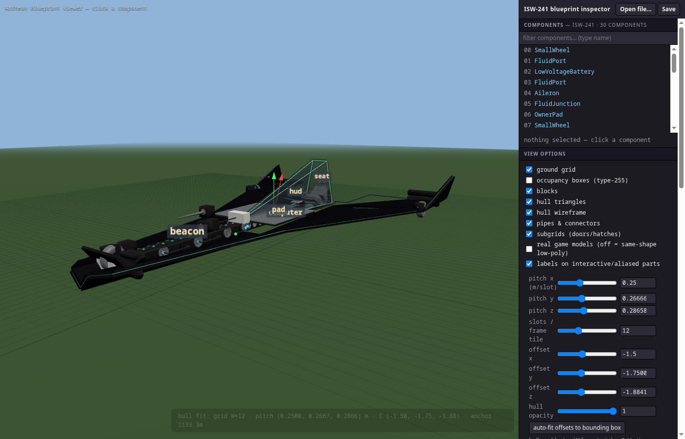

# Archean Blueprint Tools · v0.124

**Reverse-engineered file format + a zero-build browser viewer/inspector for
workshop craft of [Archean](https://store.steampowered.com/app/2941660/Archean/)**
— the voxel/particle space-sim sandbox by batcholi / FloDKSM.



Archean stores every workshop craft as a compact `blueprint.json` — components,
voxel blocks, hull-triangle meshes, fluid/power wiring, nested door subgrids.
The format is undocumented; this repository reverse-engineers it (see
[FORMAT.md](FORMAT.md)) and ships the tooling that grew out of that work.

Everything is static — plain ES modules + Three.js from a CDN. No build step,
no npm, no server-side code.

## ▶ Live viewer

**Overview + craft gallery: https://joeppie.github.io/archean-blueprint-tools/**

**https://joeppie.github.io/archean-blueprint-tools/viewer/index.html**

Loads the ISW-241 fighter by default. Click any component to edit position,
rotation and data fields with live 3D feedback; *Open file…* (or drag-drop)
loads any `blueprint.json`, and **Save** writes it back byte-exact in the
game's own compact JSON format, keeping the block/occupancy mirror in sync.

## What the viewer shows

- **Real game components** — the game's own models (extracted from installed
  game modules) with your painted colours (`color1`/`color2`), real masses,
  joint limits (aileron ±45° hinge) and port positions. The game renders with
  raytracing, so its meshes are far denser than a raster GPU likes: the
  default view is therefore a **same-shape decimated twin** (boxes + hexagons,
  micro-detail removed), verified per-type against the real mesh by
  `?proxytest`. Tick “real game models” for the full geometry.
- **Hull skins** — hull triangles share the *exact* voxel lattice
  (`world = frame·3 − 1.5 + v·0.25`, welded shared vertices) and render as the
  closed 0.05 m prisms the game draws, with all five stored colours
  (front/back/rim). A “wireframe (hull + blocks)” overlay shows triangle and
  block edges together, in their real colours.
- **Everything else in the file** — voxel blocks in their real shapes (a block's
  `type` packs shape+orientation: cubes, slopes, corners, pyramids, inverse
  corners — the reason voxel hulls look curved) in their real **linear**
  palette colours with the game's roughness/metallicity/transparency rules,
  nested door/hatch subgrids, fluid pipes with port markers, adapter nubs,
  CoM/declared-mass cross-check, stylized thin-plate flight analysis
  (CoP/static margin, particles + streamlines — labelled *not CFD*),
  floating labels on cockpit-interactive parts (`dash`, `seat`, `button`,…
  plus in-game aliases).
- **Built for weak GPUs** — blocks/pipes/streamlines/ports each merged into
  single draw calls, on-demand rendering (idle = GPU asleep), clamped pixel
  ratio. ~150 draw calls for a 30-component fighter.

## Repository map

| path | what |
|---|---|
| `viewer/` | the 3D inspector/editor (one ES module + hullfit + palette + lazy model atlas) |
| `viewer/models/` | 106 component types: geometry (full + low-poly), mass, joints, ports, colliders — generated by `tools/extract_models.py` from an installed game |
| `regtest/` | format-validation suite over the whole `testdata/` corpus (auto-discovers craft) |
| `testdata/` | 25 workshop blueprints (1 kB–2.5 MB, incl. the Classic American Semi Truck) used as regression corpus |
| `tools/extract_models.py` | regenerates `viewer/models/` from a local Archean install |
| `tools/adjust_seat.py` | example of a safe scripted format edit |
| `tests/run_tests.sh` | headless-Chromium suite: selftest, regtest, proxytest, render shots |
| `FORMAT.md` | the format documentation — start here |
| `AGENTS.md` | development guide for humans *and* coding agents |
| `NOTICE.md` | licensing: code GPL-3.0; game/player content belongs to its respective owners |

## Running locally

```bash
python3 -m http.server 8650          # repo root
# viewer:  http://127.0.0.1:8650/viewer/index.html
# suite:   tests/run_tests.sh        (python3 + chromium; exit 0 = all green)
```

Useful URL parameters: `?open=<url>` open another blueprint ·
`?real` full game geometry · `?flow` particles + streamlines ·
`?hull` / `?occ` toggles · `?cam=x,y,z,tx,ty,tz` camera pose ·
`?perf` draw-call probe in the tab title · `?selftest`, `?proxytest` test modes.

## Ideas welcome — open an issue!

This is v0.124: the format is decoded and the viewer is useful, but the good
ideas are not all in yet. Feature requests, format questions, and craft that
render wrong (attach the `blueprint.json`) are all best filed as
[issues](https://github.com/Joeppie/archean-blueprint-tools/issues) — that is
where the roadmap lives. Already on the list:

- Better flight-characteristics analysis (360° velocity sweep, trim polar).

## Licensing (short version — see NOTICE.md)

- **Code**: GPL-3.0 (copyleft is deliberate — improvements stay open).
- **Game content** (`viewer/models/`, `testdata/`, FORMAT.md knowledge):
  belongs to the Archean developer (batcholi / FloDKSM). Player-made workshop
  craft in `testdata/` belong to their workshop authors. All works belong to
  their respective owners.
- **No rights-holder permissions are claimed.** Reuse of the included
  third-party content is presumed acceptable in good faith, CC-attribution
  spirit; rights holders who disagree can raise an issue and it will be
  addressed amicably and promptly (NOTICE §4).
